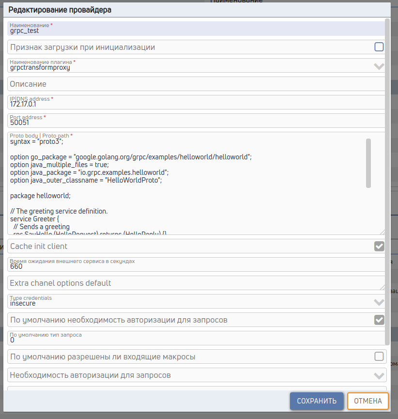

# Универсальный провайдер вызова внешних сервисов

## 1. Подключение провайдера
Пример настроек t_providers.toml
```toml
[[data]]
ck_id = "example"
ck_d_plugin = "grpctransformproxy"

  [data.cct_params]
  cacheClient = "1"
  timeout = 660
  host = "172.17.0.1"
  port = "50051"
  proto = """
syntax = "proto3";

option go_package = "google.golang.org/grpc/examples/helloworld/helloworld";
option java_multiple_files = true;
option java_package = "io.grpc.examples.helloworld";
option java_outer_classname = "HelloWorldProto";

package helloworld;

// The greeting service definition.
service Greeter {
  // Sends a greeting
  rpc SayHello (HelloRequest) returns (HelloReply) {}
}

// The request message containing the user's name.
message HelloRequest {
  string name = 1;
}

// The response message containing the greetings
message HelloReply {
  string message = 1;
}"""
```


## 2. Сервис
Создаем сервис или метод модификации, с телом
```json
{
package: "helloworld",
service: "Greeter",
method: "SayHello",
args: [{name: `${jt_in_param.name}`}],
}
```
package - пакет

service - сервис пакета

method - метод сервиса вызова

args - Параметры вызова

resultParse - методы парсинга и разбора ответа, заполняем если надо

resultRowParse - метод парсинга ответа построчно.

streamResponse - признак что ответ stream, по умолчанию false

streamRequest - признак что запрос stream, по умолчанию false

channelOptions - дополнительные настройки канала, заполняем если надо

### Доступные переменные

jt_in_param - входные переменные

jt_request_header - входные заголовки http

jt_request_method - входной метод

jt_provider_params - переменные настройки провайдера

#### в методе resultParse доступен

jt_result - ответ вызова

#### в методе resultRowParse доступен

jt_result - ответ вызова

jt_result_row - строка вызова

jt_result_row_index - номер строки