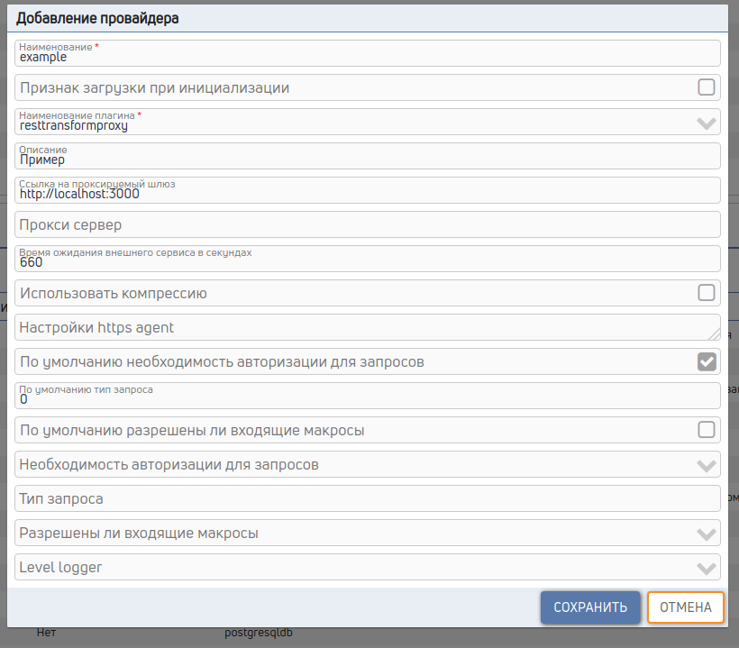

# Универсальный провайдер вызова внешних сервисов

## 1. Подключение провайдера
Пример настроек t_providers.toml
```toml
[[data]]
ck_id = "example"
cl_autoload = 0
ck_d_plugin = "resttransformproxy"
cv_description = "Пример"

  [data.cct_params]
  timeout = 660
  defaultGateUrl = "http://localhost:3000"
```


## 2. Сервис
Создаем сервис или метод модификации, с телом
```json
{
    method: 'POST',
    url: `${jt_provider_params.defaultGateUrl}`,
    resultPath: "",
    json: { test: 1 },
    resultParse: 'jt_result.length === 0 || !jt_result[0].total ? [] : jt_result',
    resultRowParse: '{ck_id: jt_result_row.id, name: jt_result_row.data.project, jn_total_cnt: jt_result_row.total, data: jt_result_row.data}',
}
```
method - метод вызова

url - путь вызова

resultPath - путь до необходимого ответа, jsonpath.

resultParse - методы парсинга и разбора ответа, заполняем если надо

resultRowParse - метод парсинга ответа построчно.

breakResult - метод проверки ответа и немедленного ответа

breakTypeResult - тип ответа gate (для более тонкой настройки ответов)

includeHeaderOut - массив заголовков http, которые надо проксировать в ответ

includeHeader - массив заголовков http, которые надо проксировать в запрос

json - формат запроса в application/json

form - формат запроса в application/x-www-form-urlencoded

formData - формат запроса в multipart/form-data

proxyResult - проксировать ответ сразу без пост обработки

excludeHeaderOut - cgbcjr исключаемs header при proxyResult

typeResult - тип ответа gate (для более тонкой настройки ответов)

доступные настройки axios ("url", "method", "baseURL", "headers", "params", "data", "timeout", "timeoutErrorMessage", "withCredentials", "adapter", "auth", "xsrfCookieName", "xsrfHeaderName", "maxContentLength", "maxRedirects", "httpAgent", "httpsAgent", "proxy")

### Доступные функции утилит

JSON - parse и stringify разбор и преоброзование json

QS - parse и stringify разбор и преоброзование query string

YAML - dump, load, loadAll разбор и преоброзование yaml

isEmpty - проверка на пустоту

lodash - разнообразные функции из пакета lodash

util - разнообразные функции из пакета lodash

Object - работа с объектом

Array - работа с массивом

encodeURIComponent - url encode

decodeURIComponent - uld decode

callRequest - функция дополнительного вызова сервиса принимает Object и имя для сохранения ответа

```json
{
    method: 'POST',
    url: `${jt_provider_params.defaultGateUrl}`,
    json: { test: callRequest({
    method: 'POST',
    url: `${jt_provider_params.defaultGateUrl}`,
}, 'test')[0] },
}
```
### Доступные переменные

jt_in_param - входные переменные

jt_request_header - входные заголовки http

jt_request_method - входной метод

jt_provider_params - переменные настройки провайдера

jt_extra_params - дополнительные настройки задданые в настройках провайдера

#### в методе resultParse и breakResult доступен

jt_result - ответ вызова

jt_response_header - заголовки http ответа

jt_body - Buffer если ответ не json

jt_response_status - статус ответа

#### в методе resultRowParse доступен

jt_result - ответ вызова

jt_body - Buffer если ответ не json

jt_response_header - заголовки http ответа

jt_result_row - строка вызова

jt_result_row_index - номер строки